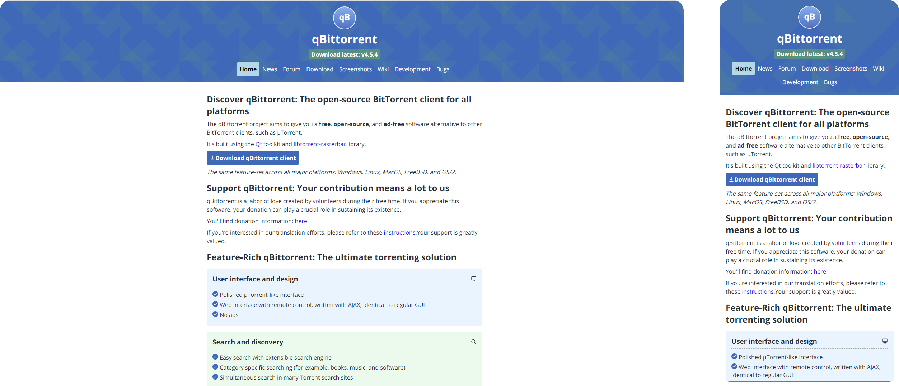

# The Modern qBittorrent Website (Un-Official)

[](https://github.com/eraychumak/qBittorrent-website/actions)
[](https://github.com/eraychumak/qBittorrent-website/actions/workflows/deploy.yaml)



**On a mission to fully re-design the qBittorrent website.** I've seen a lot of people wanting a fresh update to the UI and waiting for PRs to get approved etc takes too long so I am just going to take my own spin at it and see where it takes me.

Live preview of the `dev` branch here: https://eraychumak.github.io/qBittorrent-website/

**Feel free to submit Issues and PRs 😁** Hopefully, one day this can be merged into the official qBittorrent-website repo if it becomes finalised enough.

## Goals

1. I don’t want to do extreme changes to the website.
2. I like the style of it and want to modernise it a tad bit that keeps up with the accessibility stuff etc
3. My main goal and priority with the website is to simply amplify what it does well already in its straightforwardness and simplicity.
4. This is not a replacement. The aim is to get this merged into the official `qBittorrent-website` repository once it is ready.


### Dev

```shell
npm run serve
```
